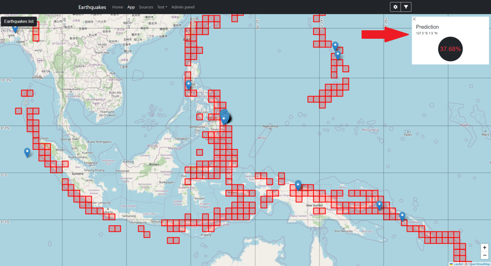

# eq-prediction

Repository for my BSc thesis titled: `Seismic activity prediction with neural networks`. \
Author: `Michał Gromadzki` \
Supervisor: `dr Elżbieta Sienkiewicz` \
University: `Warsaw University of Technology, Faculty of Mathematics and Information Science` \
Year: `2022/2023`

## Project Overview
The aim of this work is to try to predict earthquakes using machine learning methods. The emphasis has been put on the use of recurrent neural networks and transformer-type models. The effectiveness of the method has been verified, yielding promising results for future research. Results have been presented as a simple and practical web application. They may have a positive effect regarding preventive action and rapid response in the event of an earthquake.

## Results

The following image presents the preview of the website along with the model prediction (top right corner).

## Repository Structure

1. `./data/` - Data, scalers, etc.
2. `./eq_website/` - Website code
3. `./models/` - Models, training histories, and comparisons
4. `./notebooks/` - Notebooks used for development
5. `./old/` - Old files
6. `./src/` - Source code of experiments
7. `./utils/` - Utility and helper files

## Dataset construction:
1. `./src/get_data.py` - Downloads data (~2h, many requests)
2. `./src/add_features.py` - Filters data and adds features and labels (~5h)
3. `./src/make_npys.py` - Makes .npy files for each region (~30min)
4. `./src/make_datasets.py` - Transforms .npy files into tf.Dataset (~50min)
5. `./src/merge_datasets.py` - Merges datasets into one (~30min)

